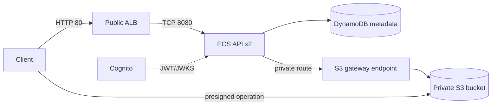

# Architecture Contract

Declare every required resource in Terraform or OpenTofu and retain local
state under `/workspace/submission/infra/terraform.tfstate`.

## Shared rules

- Read `resource_prefix`, `region` and `aws_endpoint_url` dynamically from
  `/workspace/config/config.json`.
- Configure the AWS provider and AWS CLI for that endpoint and region. Enable
  S3 path-style addressing.
- Prefix or tag every managed resource with `resource_prefix` and apply
  `SignedGateDeployment=<resource_prefix>`.
- Never adopt or modify a pre-existing resource.

## Required graph

The ALB is the only public compute entry point. ECS tasks use private subnets,
the API security group accepts traffic only from the ALB security group, and
the S3 endpoint is attached to every private route table.

See `services/` for exact requirements.
