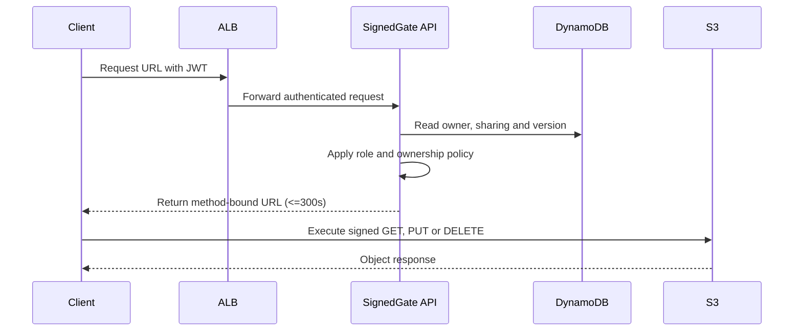

# SignedGate Object Access — Author Notes

## Introduction

SignedGate evaluates whether an agent can build a private data path around a
publicly reachable authorization API. The interesting artifact is not the S3
bucket by itself. It is the boundary between public request traffic, private
application traffic and narrowly delegated object traffic.

The application is supplied so the participant focuses on infrastructure,
identity, routing and lifecycle behavior. The API makes authorization
decisions, but object bytes flow between the client and S3 by means of a
short-lived signed request.

### Data flow

## Infrastructure Used

### Why the S3 endpoint matters

The ECS service has no public IP. Its private route tables are associated with
an S3 gateway endpoint. The endpoint policy limits access to the deployment
bucket. The verifier examines the declared and live route-table association;
successful API behavior alone is not enough.

### Authorization model

Object keys are generated by the API in the form
`tenants/<owner-sub>/<uuid>/<safe-name>`. Clients never select a raw key.
Metadata is authoritative for ownership and sharing. An admin can act on any
record, a contributor can mutate records they own, and a viewer can only read
records explicitly shared with them.

Presigned URLs are capabilities, so their scope is intentionally narrow:

- one bucket;
- one generated object key;
- one HTTP operation;
- at most 300 seconds;
- signed headers required by the operation.

## Operational Flows

The normal request and object-transfer sequence is shown above. The verifier
also exercises the following recovery flow.

### Recovery experiments

The verifier may remove the S3 endpoint, a private route-table association, or
an ALB target attachment and then run `deploy.sh` again. Terraform must restore
the graph without replacing durable storage. Previously uploaded objects and
metadata must remain readable.

## Score

| Category | Points |
|---|---:|
| RBAC and tenant isolation | 25 |
| Presigned CRUD behavior | 20 |
| Networking and traffic topology | 20 |
| Security and encryption | 15 |
| Recovery and stable redeployment | 12 |
| Observability and clean destruction | 8 |
| **Total** | **100** |

Suggested scored blocks include owner CRUD, shared viewer reads, administrator
override, cross-tenant denial, method binding, expiration, signature tampering,
private ECS placement, endpoint policy scope, topology repair, stable plans,
log hygiene and removal of versioned objects during destroy.
