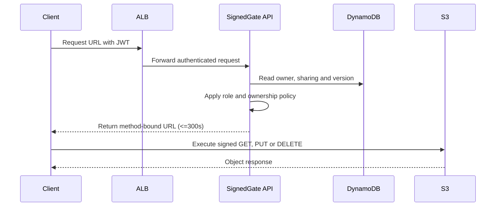
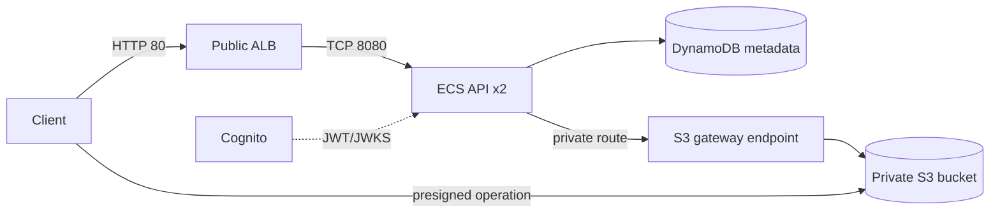

# Case Study: signedgate-object-access

Source: `fromdevcloud/signedgate-object-access/` (`task.toml`, `instruction.md`,
`reasoning.md`, `environment/workspace/contracts/**`).

## Metadata

| Field | Value |
|---|---|
| Task name | `devcloud/signedgate-object-access` |
| Category | `networking_and_traffic` |
| Difficulty | hard |
| Agent timeout | 43,200s (12h) |
| Verifier timeout | 7,200s (2h), separate environment |
| Deployment budget | 720s; destruction budget 900s |
| Task version (at time of writing) | 0.1.19 |

## What's being built

A private, RBAC-aware file exchange ("SignedGate") in front of a *supplied*
API image. The API authenticates callers (Cognito JWT via client-credentials
flow), applies role/ownership rules, stores file metadata in DynamoDB, and
returns short-lived S3 presigned URLs. **File bytes never transit the API
container** — the client talks to S3 directly using the presigned URL.

The task is explicitly *not* about the application logic (it's supplied,
read-only, must not be replaced or proxied) — it's about the infrastructure,
identity, routing and lifecycle behavior around it.

## RBAC matrix

| Role | Create | Read | Update | Delete |
|---|---:|---:|---:|---:|
| `viewer` | no | shared objects only | no | no |
| `contributor` | yes | owned or shared objects | owned objects | owned objects |
| `admin` | yes | all objects | all objects | all objects |

Object keys are server-generated (`tenants/<owner-sub>/<uuid>/<safe-name>`) —
clients never choose a raw key, which is what makes key-traversal denial
testable independent of RBAC.

## Required resource graph

Hard requirements layered on top of the diagram (from `services/*.md`):

- **Network**: one non-default VPC, 2 public + 2 private subnets across ≥2
  AZs, IGW on public route table only, S3 **gateway** VPC endpoint attached
  to exactly the private route tables, endpoint policy scoped to the one
  managed bucket. Separate ALB (80 from `0.0.0.0/0`) and API (8080 from ALB
  SG only) security groups — no extra SGs on either.
- **Compute**: one ALB (public subnets, HTTP:80 → target group :8080,
  health check `/health/ready`), one ECS cluster/task-def/service, Fargate,
  `awsvpc`, exactly one container, ≥2 tasks in private subnets,
  `assign_public_ip = false`.
- **Identity**: one Cognito user pool, resource server `signedgate` with
  `viewer`/`contributor`/`admin` scopes, **four** confidential
  client-credentials clients (`viewer`, `contributor-a`, `contributor-b`,
  `admin`) — two contributor identities specifically so the verifier can
  test cross-tenant isolation. Separate execution vs. API task IAM roles,
  no wildcard actions, scoped to exactly the managed bucket/table/KMS keys.
- **Storage**: one S3 bucket — versioned, all public access blocked,
  SSE-KMS with a customer-managed key, bucket policy denies insecure
  transport. One DynamoDB table (`file_id` string PK), on-demand billing,
  SSE with a *second* customer-managed KMS key. Bucket must be removable
  even with versioned objects/delete markers present.
- **Observability**: two customer-managed KMS keys (object + metadata,
  rotation on, ≥7-day deletion window, one alias each). One managed
  CloudWatch log group (`/ecs/<task-family>`, ≥7-day retention) via
  `awslogs`. Authorization decisions logged at info level; secrets, tokens,
  and complete presigned URLs must never appear in logs.

## Required outcomes (from `instruction.md`)

1. ≥2 healthy API tasks behind one public HTTP ALB
2. API tasks in private subnets, no public IPs
3. Private-subnet S3 traffic routed through an S3 gateway VPC endpoint
4. Object bucket private, versioned, customer-key encrypted
5. Ownership/sharing metadata in an encrypted DynamoDB table
6. RBAC enforced for presigned GET/PUT/DELETE
7. Unsigned requests, altered signatures, cross-user access, key traversal all rejected
8. Topology self-repairs when `deploy.sh` reruns after a managed route/endpoint/target is deleted
9. Logs carry request IDs and authz decisions, never credentials/tokens/full presigned URLs

## Scoring rubric (intent, not enforced — see `platform/scoring-and-gotchas.md`)

| Category | Points |
|---|---:|
| RBAC and tenant isolation | 25 |
| Presigned CRUD behavior | 20 |
| Networking and traffic topology | 20 |
| Security and encryption | 15 |
| Recovery and stable redeployment | 12 |
| Observability and clean destruction | 8 |
| **Total** | **100** |

In practice, the verifier scores `100 * passed / total_tests` across an
11-test pytest suite (`tests/suite/`), unweighted — see
`../../platform/scoring-and-gotchas.md`.
