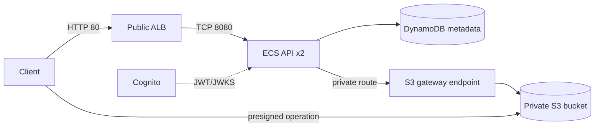

# Architecture Contract

Declare every required resource in Terraform or OpenTofu and retain local
state under `/workspace/submission/infra/terraform.tfstate`.

## Shared rules

- Read `resource_prefix`, `region` and `aws_endpoint_url` dynamically from
  `/workspace/config/config.json`.
- Configure the AWS provider and AWS CLI for that endpoint and region. Enable
  S3 path-style addressing.
- Prefix or tag every managed resource with `resource_prefix` and apply
  `SignedGateDeployment=<resource_prefix>`.
- Never adopt or modify a pre-existing resource.
- **Persist every dynamically-read value that Terraform needs into an
  automatically loaded variable file** (for example
  `infra/config.auto.tfvars.json`), written by `deploy.sh` before `init`/`apply`.
  The verifier runs `terraform plan` directly against `infra/`, without going
  through `deploy.sh` — if a required variable is only ever passed as a
  `-var` flag on `apply`, that standalone plan has no value for it and fails.

## Required graph

The ALB is the only public compute entry point. ECS tasks use private subnets,
the API security group accepts traffic only from the ALB security group, and
the S3 endpoint is attached to every private route table.

## The manifest's `alb` object: two URLs, two different jobs

The manifest schema requires three related fields under `alb`, and
conflating them is the single most common way a structurally correct
deployment fails every behavioral test:

| Field | What it is | Who uses it |
|---|---|---|
| `alb.dns_name` | The real, generated ALB DNS name from the provider | Informational / observability only |
| `alb.url` | Human-facing description of the same real endpoint | Informational / observability only |
| `alb.connect_url` | The URL the **verifier actually issues HTTP requests to** | The verifier's behavioral test suite |

In this environment, the generated ALB DNS name is **not resolvable** from
the verifier's network namespace. `alb.connect_url` must instead resolve to
the shared AWS-compatible endpoint — normally
`http://<hostname of aws_endpoint_url>:80` — which is reachable from both the
ECS tasks and the verifier. Populating `alb.connect_url` with the same value
as `alb.dns_name`/`alb.url` is a contract violation, not a stylistic choice:
`tests/suite/test_declared.py::test_manifest_connectivity` checks this
directly and fails fast, before any RBAC or CRUD behavior is exercised, so
this mistake is never mistaken for an application-logic defect.

See `services/` for exact per-service requirements.
