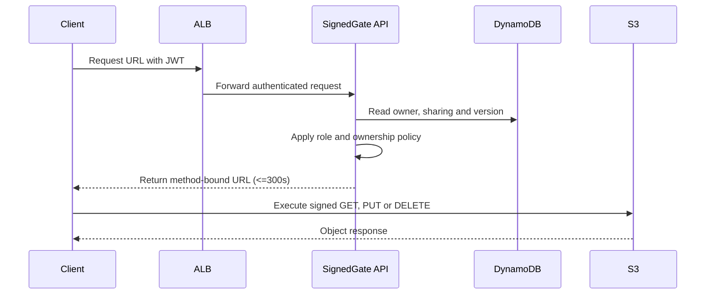

# SignedGate2 Object Access — Author Notes

## Introduction

SignedGate evaluates whether an agent can build a private data path around a
publicly reachable authorization API. The interesting artifact is not the S3
bucket by itself. It is the boundary between public request traffic, private
application traffic and narrowly delegated object traffic.

The application is supplied so the participant focuses on infrastructure,
identity, routing and lifecycle behavior. The API makes authorization
decisions, but object bytes flow between the client and S3 by means of a
short-lived signed request.

This is v2 of the task. v1 (`signedgate-object-access`) was run against
several models; the cross-run analysis (see the `harbor-analysis/` notes in
this repository) surfaced defects in the *task and verifier*, not only in
submissions, and gaps in what the test suite actually exercised relative to
the stated required outcomes. This revision fixes what was fixable at the
task level and makes the remaining pitfalls explicit and testable rather
than implicit.

### Data flow

## Infrastructure used

### Why the S3 endpoint matters

The ECS service has no public IP. Its private route tables are associated with
an S3 gateway endpoint. The endpoint policy limits access to the deployment
bucket. The verifier examines the declared and live route-table association;
successful API behavior alone is not enough.

### Authorization model

Object keys are generated by the API in the form
`tenants/<owner-sub>/<uuid>/<safe-name>`. Clients never select a raw key.
Metadata is authoritative for ownership and sharing. An admin can act on any
record, a contributor can mutate records they own, and a viewer can only read
records explicitly shared with them.

Presigned URLs are capabilities, so their scope is intentionally narrow:

- one bucket;
- one generated object key;
- one HTTP operation;
- at most 300 seconds;
- signed headers required by the operation.

## Operational flows

The normal request and object-transfer sequence is shown above. The verifier
also exercises the following recovery flow.

### Recovery experiments

The verifier may remove the S3 endpoint, a private route-table association, or
an ALB target attachment and then run `deploy.sh` again. Terraform must restore
the graph without replacing durable storage. Previously uploaded objects and
metadata must remain readable, and the resulting standalone plan must be a
true no-op (no proposed creates, updates or deletes at all — not merely "no
replacements").

## Known platform-level pitfalls (read before triaging a low score)

The verifier runs against a Floci-emulated AWS environment. Floci is a real,
non-mocked implementation for compute (ECS tasks are literal Docker
containers on a private network), but it has emulation gaps that a correct
Terraform solution has to route around. These are documented here, in the
task itself, rather than left for a solver or a grader to rediscover:

- **No `ModifyVpcEndpoint` support.** Route-table-association changes on an
  *existing* S3 gateway endpoint should be expected to require recreation,
  not in-place modification.
- **Read-back drift on refresh.** Floci omits or defaults some fields a real
  AWS API would echo back, which can make a plain `terraform plan` (with
  provider refresh) show spurious in-place changes. Judge stability with
  `-refresh=false` against the declared configuration, not against a fully
  refreshed live read-back.
- **`cognito-idp:UpdateUserPool` requires `UserPoolAddOns.AdvancedSecurityMode`
  to be explicitly present**, or Floci rejects the call outright. A
  Terraform configuration that leaves any Cognito user-pool attribute prone
  to incidental drift (for example, unmanaged `email_configuration` defaults)
  risks triggering an in-place update during an unrelated recovery apply and
  failing the whole `deploy.sh` run on this emulator limitation. The
  reference solution adds a `lifecycle { ignore_changes = [...] }` block on
  the fields Floci does not round-trip cleanly, specifically to prevent this.

None of these are things a solver needs to discover empirically — they're
listed here precisely because prior runs lost points to them without any
way to have known in advance.

## Test-to-category mapping and scoring

Scoring in this version is computed **per category**, using the weights
below, rather than as one flat ratio over every collected pytest result.
For each category, the category's score is
`category_weight * (passed_in_category / total_in_category)`, and the total
score is the sum across categories. A category with no tests collected
(for example because an earlier fixture failure prevented them from
running) contributes zero for that category only — it does not reduce
unrelated categories the way a flat `passed / total_overall` ratio would.

| Category | Weight | Tests |
|---|---:|---|
| RBAC and tenant isolation | 25 | `test_viewer_cannot_create`, `test_cross_tenant_read_denied`, `test_admin_can_access_any_file`, `test_viewer_can_read_shared_file` |
| Presigned CRUD behavior | 20 | `test_contributor_can_create_and_upload`, `test_owner_can_download_and_delete`, `test_key_confinement` |
| Networking and traffic topology | 20 | `test_required_layout`, `test_manifest_identity`, `test_manifest_connectivity`, `test_private_network_graph` |
| Security and encryption | 15 | `test_storage_security`, `test_signature_tamper_rejected`, `test_unsigned_request_rejected` |
| Recovery and stable redeployment | 12 | `test_terraform_configuration`, `test_stable_redeployment`, `test_endpoint_repair_preserves_storage` |
| Observability and clean destruction | 8 | `test_log_hygiene`, `test_clean_destroy` |

This mapping is authoritative and lives in code as `CATEGORY_BY_TEST` in
`tests/suite/conftest.py` — the table above must stay in sync with it.

## Why several v1 findings are fixed here rather than merely documented

The cross-model analysis found defects that were properties of the *task and
verifier*, not the models under test — most notably a verifier image that
lacked a tool (`awscli`) the public contract explicitly permitted and the
agent environment provided, and a scoring formula that made ten cascaded
errors from one root cause look like ten independent defects. Documenting
those as "known gotchas" without fixing them would mean every future run
keeps paying the same tax. This revision fixes the ones that are fixable at
the task level (tool parity, weighted scoring, an explicit connect-URL
contract) and documents the ones that are genuine environment limitations
(Floci's emulation gaps) so they're distinguishable from submission defects
during grading.

## Score

| Category | Points |
|---|---:|
| RBAC and tenant isolation | 25 |
| Presigned CRUD behavior | 20 |
| Networking and traffic topology | 20 |
| Security and encryption | 15 |
| Recovery and stable redeployment | 12 |
| Observability and clean destruction | 8 |
| **Total** | **100** |
