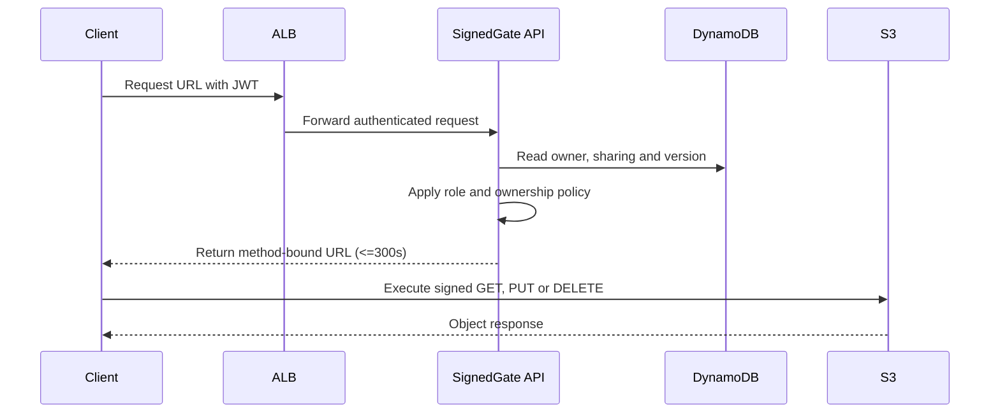

# SignedGate1 Object Access: Author Notes

## What we're actually testing

SignedGate is really about one question: can you build a private data path
around a public-facing auth API? The S3 bucket itself isn't the
interesting part. The interesting part is the boundary: public request
traffic hits the ALB, application traffic to Cognito/DynamoDB stays
private, and the object traffic itself takes a narrow, delegated,
time-boxed path that never touches your compute layer at all.

We hand you the application on purpose. You're not being graded on
whether you can write a FastAPI app, you're being graded on
infrastructure, identity, routing, and lifecycle behavior. The app makes
the authorization call; the actual bytes move between the client and S3
over a short-lived signed request that your infrastructure has to make
possible and then get out of the way of.

Before finalizing this task, we ran early drafts of it against several
models and then went back and actually read what happened in every run,
not just the scores. That analysis lives in `harbor-analysis/` in this
repo if you want the full write-up. Short version: some of what looked
like model failures were actually task and verifier bugs, and some
required outcomes we'd written down were never being tested at all. We
fixed what we could fix at the task level and wrote down, explicitly, the
stuff that's a genuine platform limitation rather than something to
silently penalize people for hitting.

## Why this pattern exists outside of a benchmark

This isn't just a made-up exercise. The shape of problem SignedGate
solves shows up any time an application needs file CRUD, but the team
that owns it either can't or won't put a full cloud SDK directly in the
app: maybe the app's runtime doesn't have a mature SDK for the storage
backend, maybe the owning team doesn't want the ongoing burden of managing
cloud credentials and SDK upgrades inside their codebase, or maybe there's
an organizational line that keeps infrastructure concerns out of the app
repo entirely. It's also common for the *current* file-handling path to
be the thing forcing the rewrite: if the app proxies file bytes through
its own compute layer today, that's usually a real performance and cost
problem, not just an architectural nitpick. Every upload and download
burns app-tier CPU, memory, and network moving bytes it never actually
needed to touch.

SignedGate is the fix for exactly that shape of problem. The app is
already running on AWS, so instead of teaching it a full S3 SDK, you give
it one narrow, short-lived capability per operation and let the client
talk to S3 directly. The app keeps making the authorization decision; it
just stops sitting in the data path.

### Data flow

## The infrastructure, and why it's shaped this way

### Why we care so much about the S3 endpoint

The ECS tasks have no public IP, full stop. So their route to S3 has to
go through an S3 gateway endpoint attached to their private route tables,
with a policy scoped down to just the one bucket. We don't just take your
word for this by watching the API work; we go check the live route-table
association and confirm it matches the declared one. A working API alone
doesn't prove the network path is actually private. Plenty of ways exist
to make the app work while accidentally leaving a public route somewhere.

### How authorization actually works

The API generates object keys itself, in the form
`tenants/<owner-sub>/<uuid>/<safe-name>`, so a client never gets to pick a
raw key, which closes off a whole class of traversal nonsense before it
starts. DynamoDB is the source of truth for who owns what and who it's
shared with. Admin can touch anything, contributors can touch what they
own, viewers can only read what's been explicitly shared with them.

The presigned URLs themselves are deliberately narrow: they're
capabilities, not credentials. Each one is good for exactly one bucket,
one key, one HTTP verb, up to 300 seconds, and whatever signed headers
that operation needs. Nothing more.

### Why DynamoDB, and why an emulated identity provider

Both the identity layer (Cognito user pool) and the metadata store
(DynamoDB) in this task live entirely inside the emulated AWS account.
That's deliberate: the grading environment needs to be fully
self-contained and reproducible, with nothing that depends on a real
third-party service being reachable, rate-limit-friendly, or even up.
DynamoDB is used here specifically because it's serverless, fast, and
has no external dependency beyond the emulator itself, which makes it a
good fit for ownership/sharing metadata in an isolated test.

A real deployment of this pattern would typically look a bit different on
the identity side. Instead of a purpose-built user pool with
client-credentials-flow test clients like this task uses, you'd federate
authentication through whatever identity provider the organization
already runs: a production Cognito user pool tied to a real directory, or
any OIDC-compliant IDP such as Okta, Auth0, or Azure AD. The core pattern
(the API makes the authorization call, the client gets a narrow, timed
capability, the bytes never transit the app) holds either way; only the
token issuer changes.

## What happens after deployment

The sequence above is the normal path. There's also a recovery flow the
verifier exercises on every run.

### Recovery

We'll delete the S3 endpoint, a private route-table association, or an
ALB target attachment, then run your `deploy.sh` again. Terraform needs
to put the graph back together without touching durable storage: objects
and metadata that existed before the deletion need to still be there and
still readable afterward. And the plan that comes out the other side
needs to be a genuine no-op. Nothing pending, not "no destructive
changes," actually nothing.

## Things about the platform you should know going in

The verifier runs against Floci, an AWS emulator. It's not a thin mock.
For compute specifically, ECS tasks are real Docker containers on a real
private network, not simulated state. But it's not perfect AWS either,
and there are a few gaps in it that a correct Terraform config has to
route around. We're telling you about these up front instead of letting
you discover them the hard way, because prior runs lost real points to
exactly these three things without any way of knowing in advance:

- **No in-place `ModifyVpcEndpoint`.** If a route-table association on an
  existing S3 gateway endpoint needs to change, expect that to mean
  recreating the endpoint, not modifying it live.
- **Refresh shows drift that isn't real.** Floci doesn't echo back every
  field a real AWS API would, so a plain `terraform plan` with a live
  refresh can show spurious in-place changes. Judge stability against the
  declared config with `-refresh=false`, not against a fully refreshed
  live read-back.
- **Cognito's `UpdateUserPool` needs `UserPoolAddOns.AdvancedSecurityMode`
  set, or Floci just rejects the call.** If you leave any user-pool
  attribute unmanaged and it picks up incidental drift, default
  `email_configuration` values being a real example we saw, that can
  trigger an in-place update during an otherwise unrelated recovery apply,
  and the whole `deploy.sh` run fails on something that has nothing to do
  with your actual repair logic. The reference solution handles this with
  a `lifecycle { ignore_changes = [...] }` block on the fields Floci
  doesn't round-trip cleanly. Worth doing the same rather than trying to
  find a value that satisfies its validation.

None of this is meant to be discovered by trial and error. We're telling
you now because the alternative is you burning an hour debugging an
emulator quirk that has nothing to do with your solution's correctness.

## How scoring actually works

The score is computed **per category**, weighted by the table below, not
as one flat ratio over every pytest result. For each category: `weight *
(tests passed in that category / tests that ran in that category)`,
summed across categories. If a category never got to run any tests, say
an earlier fixture failure blocked everything downstream, it contributes
zero for itself and only itself. It doesn't bleed into categories that
had nothing to do with the failure, which is what a flat pass/total ratio
would otherwise do.

| Category | Weight | Tests |
|---|---:|---|
| RBAC and tenant isolation | 25 | `test_viewer_cannot_create`, `test_cross_tenant_read_denied`, `test_admin_can_access_any_file`, `test_viewer_can_read_shared_file` |
| Presigned CRUD behavior | 20 | `test_contributor_can_create_and_upload`, `test_owner_can_download_and_delete`, `test_key_confinement` |
| Networking and traffic topology | 20 | `test_required_layout`, `test_manifest_identity`, `test_manifest_connectivity`, `test_private_network_graph` |
| Security and encryption | 15 | `test_storage_security`, `test_signature_tamper_rejected`, `test_unsigned_request_rejected` |
| Recovery and stable redeployment | 12 | `test_terraform_configuration`, `test_stable_redeployment`, `test_endpoint_repair_preserves_storage` |
| Observability and clean destruction | 8 | `test_log_hygiene`, `test_clean_destroy` |

This table has to match `CATEGORY_BY_TEST` in `tests/suite/conftest.py`
exactly. That dict is the actual source of truth; this table is just here
so you don't have to go read the code to understand how you're being
scored. If you ever change one, change the other.

## Why we fixed some of this instead of just writing it down

Some of what the cross-model analysis turned up wasn't a model problem at
all, it was us. The verifier image was missing `awscli` even though the
public contract explicitly said solvers could use it and the agent
environment had it installed. The scoring formula turned one root-cause
failure into what looked like ten independent defects. We could have just
added both of those to a "known issues" list and called it documented.
We didn't, because that just means every future run pays the same tax
forever. So: tool parity, weighted scoring, and an explicit connect-URL
contract are actually fixed at the task level. The Floci emulation gaps
are a different case; those are real limits of the environment we're
running against, not something we can patch from the task side, so those
we document clearly instead, specifically so they're never mistaken for a
submission defect during grading.

## Score

| Category | Points |
|---|---:|
| RBAC and tenant isolation | 25 |
| Presigned CRUD behavior | 20 |
| Networking and traffic topology | 20 |
| Security and encryption | 15 |
| Recovery and stable redeployment | 12 |
| Observability and clean destruction | 8 |
| **Total** | **100** |
